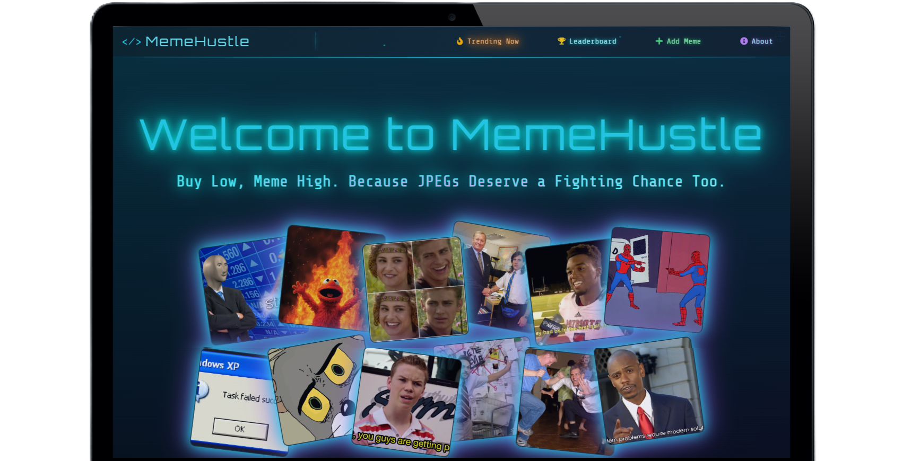
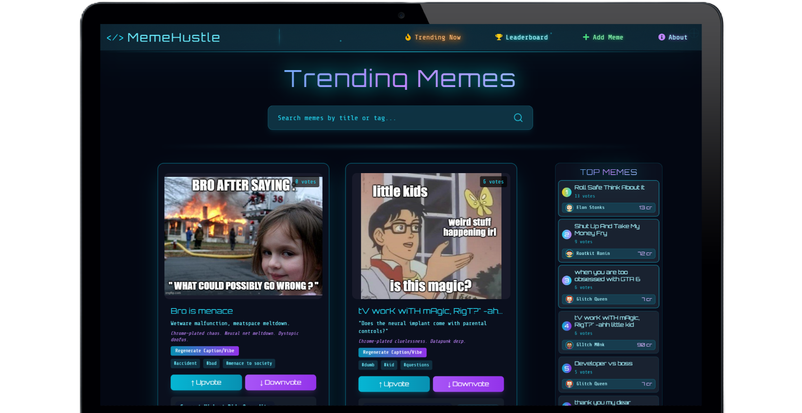
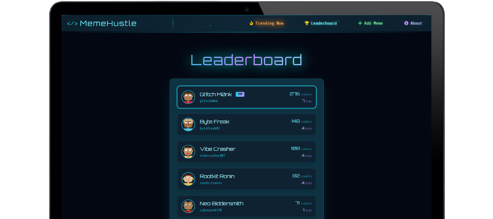
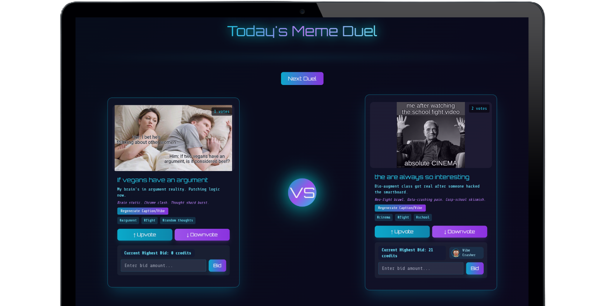
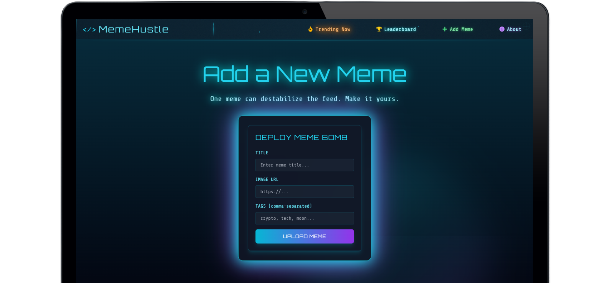

# MemeHustle 🚀

Welcome to **MemeHustle** — the futuristic meme trading platform where you can bid, and battle memes in real time! JPEGs finally get the respect (and market) they deserve.

---

## 🌟 Features

- **Real-Time Meme Trading:**
  - Bid on memes and see updates instantly across all users via Socket.IO.
  - Upvote and downvote memes to influence their popularity and leaderboard position.

- **Live Leaderboard:**
  - The "Top Memes" leaderboard updates in real time based on upvotes and highest bids.
  - Displays meme titles, votes, and top bidders with avatars and bid amounts.

- **Meme Duel:**
  - Face-off between two memes at a time — upvote, downvote, or place your bid!

- **Beautiful Collage Hero Section:**
  - Eye-catching animated collage of meme images using optimized `.webp` assets.

- **Mock User System:**
  - Each session is assigned a random cyberpunk meme trader identity.

- **Modern UI/UX:**
  - Responsive, neon-cyberpunk design with smooth animations and toasts for feedback.

---

## 🛠️ Tech Stack

- **Frontend:** React, Tailwind CSS, GSAP, Framer Motion, Socket.IO Client
- **Backend:** Node.js, Express, Socket.IO, Supabase (Postgres)
- **Assets:** Optimized `.webp` meme images

---

## ✨ Improvements & Fixes Made

- Migrated all meme assets to `.webp` for faster loading and better quality.
- Implemented real-time updates for the leaderboard and meme cards using Socket.IO.
- Enhanced leaderboard UI for clarity, compactness, and better separation from meme cards.
- Removed credit limitations — users can now bid as much as they want!
- Added robust error handling and user feedback with beautiful toast notifications.
- Refactored code for maintainability and scalability.

---

## 📸 Screenshots

### Home Page


### Trending Page


### Leaderboard Page


### Meme Duel Page


### Add Meme Page


---

## 🚀 Getting Started

1. **Clone the repo:**
   ```bash
   git clone https://github.com/vipulkatwal/meme.git
   cd meme
   ```

2. **Install dependencies:**
   ```bash
   cd client
   npm install
   cd ../server
   npm install
   ```

3. **Set up environment variables:**
   - Copy `.env.example` to `.env` in both `client` and `server` folders and fill in your Supabase and API details.

4. **Run the app locally:**
   - Start the backend:
     ```bash
     cd server
     npm run dev
     ```
   - Start the frontend:
     ```bash
     cd client
     npm run dev
     ```
   - Visit [http://localhost:5173](http://localhost:5173)

---

## 📁 Project Structure

```
memehustle/
  client/
    public/assets/      # Meme images (.webp)
    src/components/     # React components (Hero, MemeCard, Leaderboard, etc.)
    src/pages/          # Page components (Trending, Leaderboard, etc.)
    src/hooks/          # Custom React hooks
    src/utils/          # Utility functions (mock user, etc.)
  server/
    routes/             # Express routes (memes, bids, etc.)
    sockets/            # Socket.IO event handlers
    config/             # Mock users, config files
```

---

## 🙌 Credits

- Meme images: Various sources, used for demo purposes only.
- UI inspired by cyberpunk and crypto trading dashboards.

---

## 💡 Future Ideas
- User authentication and profiles
- Meme minting and NFT integration
- Meme trading history and analytics
- Social sharing and meme creation tools

---

> **Built with 💙 for meme lovers and hustlers everywhere!**
